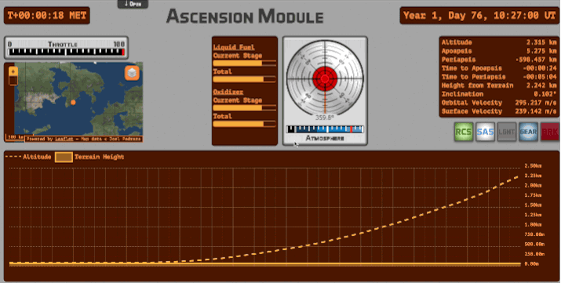
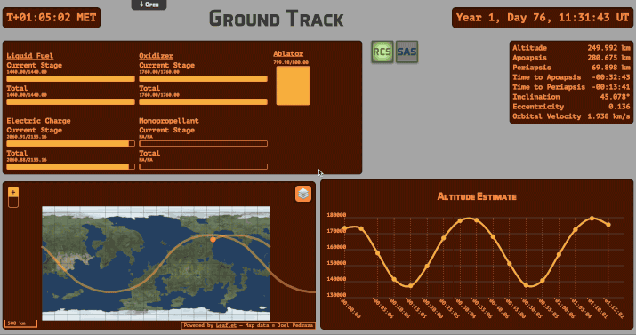
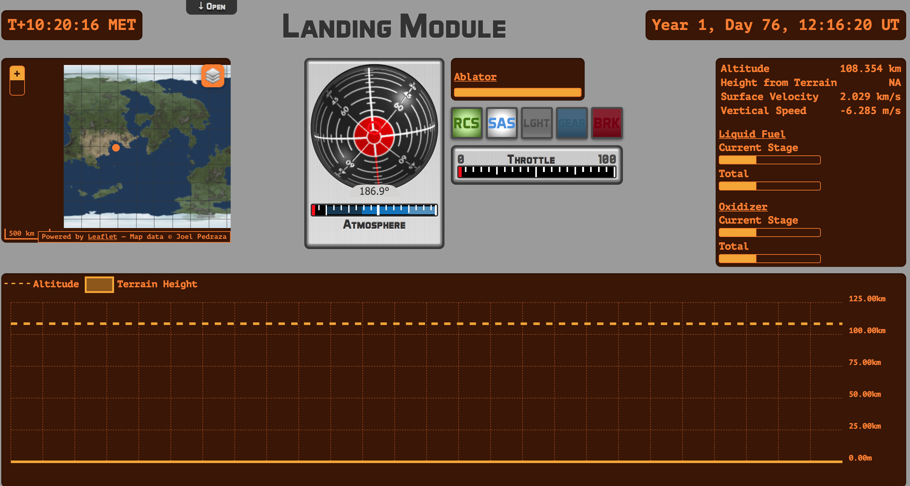
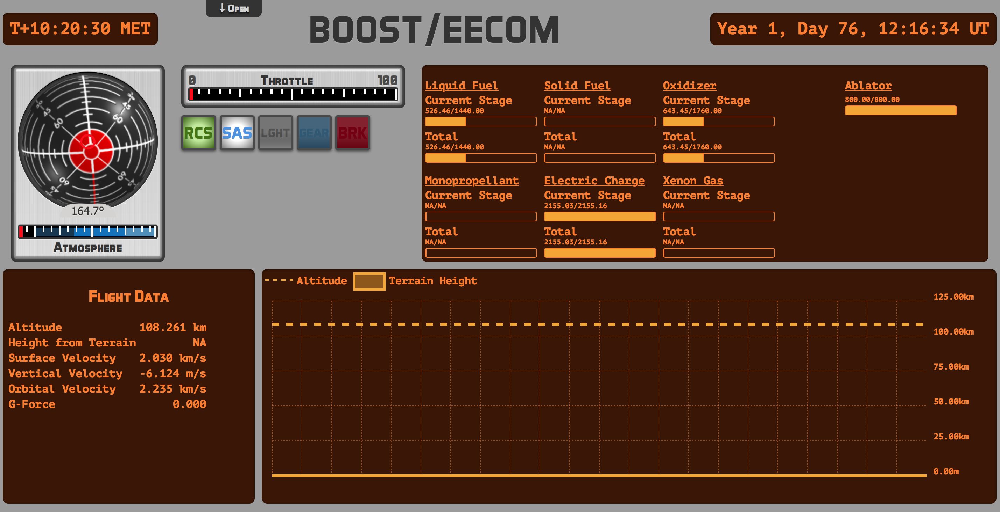
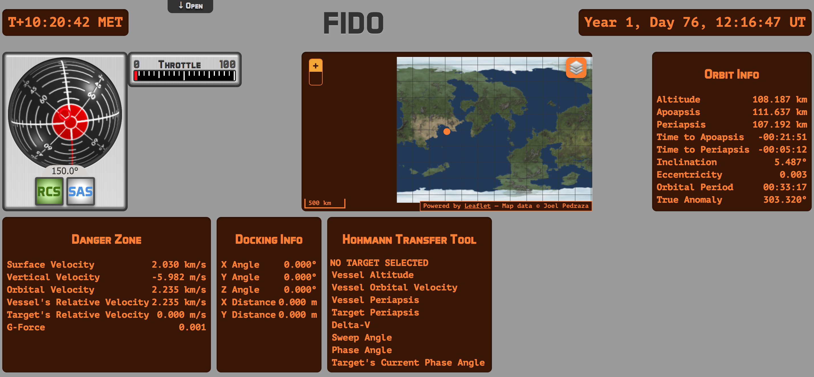
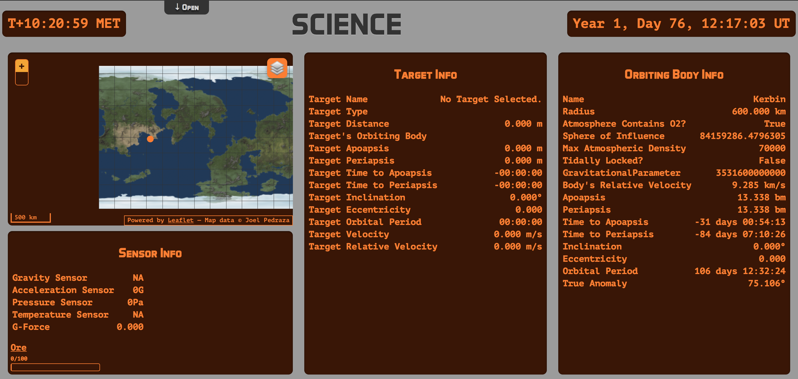

# Houston: KSP Mission Control for Telemachus Reborn

Have you ever been launching Kerbals into the Sun and thought

> You know what I need? MOAR SCREENS!

Do you have a bunch of friends who haven't done something unbelievably nerdy in the past 6 months?

If the answer to either of these questions is *"Sure?"*, then behold **Houston**:

Houston is a UI for [Telemachus Reborn](http://github.com/TeleIO/Telemcahus-1), the premiere mod for KSP Telemetry and Flight Control data.

Houston's designed for Mission Control Parties. What's a Mission Control Party? It's when you get a bunch of friends together and each person has a separate station, and you somehow have to coordinate with the pilot (who you may have locked in the bathroom with some snacks for dramatic effect) to try to pull off an actual mission.

You could also use it playing solo, switching between stations as needed.

Want to see some more? Here's a GIF of the Ground Track in action!

## What's Houston got?

Houston has a ton of really cool features, some of which work!

* A ground track, for plotting the path of a ship in orbit
* An altitude estimate for said ground track (heavy emphasis on "estimate")
* Readouts for the stock resource types in KSP
* Status light indicators
* A 3D navball (**huuge** thanks to [Lokaltog/KeRD](https://github.com/Lokaltog/KeRD) for an awesome implementation)
* Throttle and Atmosphere gauges
* Position Maps
* A 3D Orbit Map (using Three.js)
* A Hohmann Transfer tool (not guaranteed to properly transfer you as per Hohmann's specifications)
* Links to the Telemachus Console and [MKON](https://github.com/chrisnic/mkon?files=1)
* **Data Tables**, whoooo!

### UIs

Houston was designed to have specialized UIs for specific stations or contexts. That way you can divide the work across a team and only focus on the relevant data. So far, Houston has:

**A ground track/orbit overview**

**An ascension module**

**A landing module**

**Combined BOOST/EECOM stations**

**A FIDO station**

**SCIEEENNNCEEE**

**Everything's accessible through a pulldown menu, including links to the Telemachus console or MKON**

## Installing

1. Install the latest version of [Telemachus](http://github.com/TeleIO/Telemachus-1/releases/latest)
2. If you are using the LATEST version of Telemachus Reborn, Houston is already packed in
3. Launch KSP, add the Telemachus parts to your ships, and have fun!

## How do I play?

I've written up two guides for how to play KSP: Houston:
* [Playing in the same room](https://github.com/tcannonfodder/houston/wiki/Playing-Houston-in-the-same-room)
* [Playing over the Internet](https://github.com/tcannonfodder/houston/wiki/Playing-Houston-over-the-Internet)

## Developing

Houston's compiled using [nanoc](http://nanoc.ws).

Make sure to install nanoc, then run `bundle install`.

You can run `guard` to automatically compile the site as you make changes, making development a breeze!

The repo structure is:

* `content`: where UIs are built
* `layouts`: where partials are stored and the site-wide layout is defined
* `lib`: various helpers for nanoc
* `licenses`: Where I store licenses
* `public`: the final compiled version of the site
* `static`: where images/JS/CSS go

Fork it and make a PR if you want to improve something! :D

## Current issues

* The actual altitudes reported in the altitude estimation chart are completely broken. It's still useful for seeing the pattern of your orbit
* The ground track doesn't always work when the orbit's inclination is > 90 degrees
* There are still some rough spots in the design
* While the layout is compatible across all modern browsers, there are still weird display issues in Firefox (I just haven't gotten around to fixing it yet)
* The ground track doesn't work for suborbital paths
* There's no "disconnected" indicator in the UI.

## Thanks to

* The [Telemachus Reborn](http://github.com/TeleIO/Telemachus-1) mod team
* [Lokaltog/KeRD](https://github.com/Lokaltog/KeRD) for an awesome Navball implementation
* [@tcannonfodder](https://github.com/tcannonfodder) for first Houstom implementation
## Why?

> Why does a man climb Everest? Because it is there
